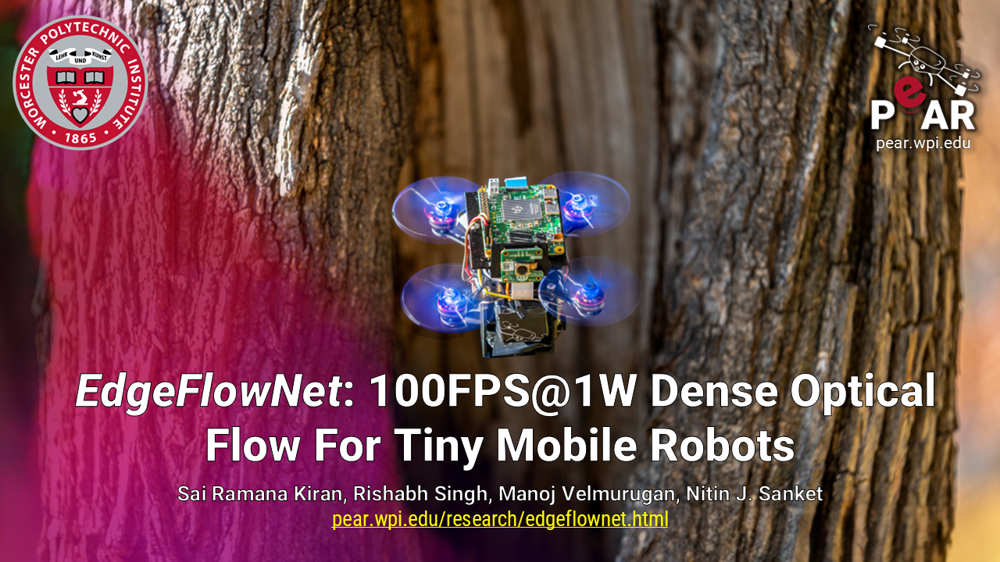

# EdgeFlowNet: 100 FPS @ 1W Dense Optical flow For Tiny Mobile Robots 

### [Project Page](https://pear.wpi.edu/research/edgeflownet.html) | [RAL Paper](https://ieeexplore.ieee.org/document/10750293) | [ArXiv](https://arxiv.org/pdf/2411.14576)

Published in IEEE RAL-2024

### Check out our Youtube video which depicts the proposed framework
[](https://pear.wpi.edu/research/edgeflownet.html)


## Abstract
**EdgeFlowNet** by <a href="http://pear.wpi.edu"><i>Perception and Autonomouș̦ Robotics Group</i></a> at the Department of Robotics Engineering, <a href="https://wpi.edu/">Worcester Polytechnic Institute</a>.

Optical flow estimation is a critical task for tiny mobile robotics to enable safe and accurate navigation, obstacle avoidance, and other functionalities. However, optical flow estimation on tiny robots is challenging due to limited onboard sensing and computation capabilities. In this paper, we propose EdgeFlowNet , a high-speed, low-latency dense optical flow approach for tiny autonomous mobile robots by harnessing the power of edge computing. We demonstrate the efficacy of our approach by deploying EdgeFlowNet on a tiny quadrotor to perform static obstacle avoidance, flight through unknown gaps and dynamic obstacle dodging. EdgeFlowNet is about 20× faster than the previous state-of-the-art approaches while improving accuracy by over 20% and using only 1.08W of power enabling advanced autonomy on palm-sized tiny mobile robots.

## Datasets:
You can download the MPI-sintel dataset from [here](http://sintel.is.tue.mpg.de/downloads) and FlyingChairs2 dataset from [here](https://lmb.informatik.uni-freiburg.de/resources/datasets/FlyingChairs.en.html#flyingchairs2)


## Code:
We provide a nvidia-docker container to run the code for different datasets

#### Docker install instructions:
* Install docker from [here](https://docs.docker.com/engine/install/)
* Also follow [post-installation steps](https://docs.docker.com/engine/install/linux-postinstall/) for linux if you dont want to run docker in `sudo` 
* Finally, follow the nvidia-docker install steps mentioned [here](https://docs.nvidia.com/datacenter/cloud-native/container-toolkit/latest/install-guide.html)

#### To run inference
We use the following structure to run the code. `dataset_path` is assumed to contain folder `Sintel` and `FlyingChairs2` datasets 
```
python wrappers/run_test.py --dataset <dataset> --dataset_path <dataset_path>
```
To run the inference on the Sintel, download the sintel and provide the corresponding path 
```
python wrappers/run_test.py --dataset sintel --dataset_path <sintel_dataset_path>
```
The `run_test.py` script does the following
- installs the docker container if it doesnt exist (takes few minutes to download for the first time)
- mounts the current repository directory and dataset directory within the docker
- runs the evaluation on the provided dataset and prints the corresponding EPE number at the end

#### To train on FC2
Similar to inference you can use the following command for training on FC2
```
python wrapers/run_train.py --dataset FC2 --dataset_path <FC2_dataset_path>
``` 

## Blender Scenes:
You can find the blender scenes and corresponding assets used in the paper in `blender` folder

## Publication:
If you find our work useful please do cite us as follows:

```
@ARTICLE{Raju2024EdgeFlowNet,
  author={Raju, Sai Ramana Kiran Pinnama and Singh, Rishabh and Velmurugan, Manoj and Sanket, Nitin J.},
  journal={IEEE Robotics and Automation Letters}, 
  title={EdgeFlowNet: 100FPS@1W Dense Optical Flow For Tiny Mobile Robots}, 
  year={2024},
  volume={},
  number={},
  pages={1-8},
  doi={10.1109/LRA.2024.3496336}
}
```

## Maintainer:
- [Sai Ramana Kiran](https://saikrn112.github.io/)

## License:
Copyright (c) 2024 Perception and Autonomous Robotics (PeAR)
